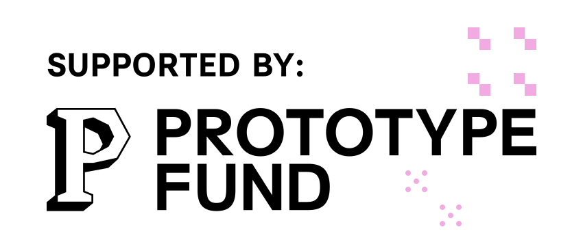

# Civitas Marketplace Add-on

This repository contains the **Civitas Marketplace Add-on**, a Next.js application that serves as the central add-on marketplace for the [Civitas/Core v2 Urban Data Platform](https://www.civitasconnect.digital/civitas-core/). It is currently under development and aims to allow users of Civitas/Core to discover, manage, and install extensions to enhance their Civitas/Core instances. 

## Scope of the Marketplace AddOn (and the whole project)

Initially, we focus for this on AddOns (note: this marketplace is technically an AddOn on its own :)) - but the goal is to extend the scope to als include artifacts like data models, connectors, pipelines and whole bundles of these in order to allow communes/CC users to install whole Use Cases ("Apps") with as little manual effort as possible. Also, plugins (a concept not currently ready in the Civitas/Core v2 codebase, but planned) should ideally be supported at a later point. 

This repository is part of a wider project spanning across at least three repositories at the moment: 
1. this marketplace-addon (which was created exclusively for this project)
2. a fork of the official Civitas/Core V2 platform repository
3. a fork of the official Civitas/Core deployment repository. 

The application integrates seamlessly with the `civitas-core-platform` via Keycloak authentication .

For detailed development instructions and documentation on how to run the app, please refer to the [App README](./app/README.md).

## Funding

This project is funded by the **Federal Ministry of Education and Research (BMBF)** as part of the **[Prototype Fund](https://prototypefund.de/)**, an initiative by the Open Knowledge Foundation Germany. 

  
  

## License

This software is released under the **EUROPEAN UNION PUBLIC LICENCE v. 1.2 (EUPL)**. The code remains fully accessible as Free and Open-Source Software (FOSS).

For more details, see the [LICENSE](./LICENSE) file.
